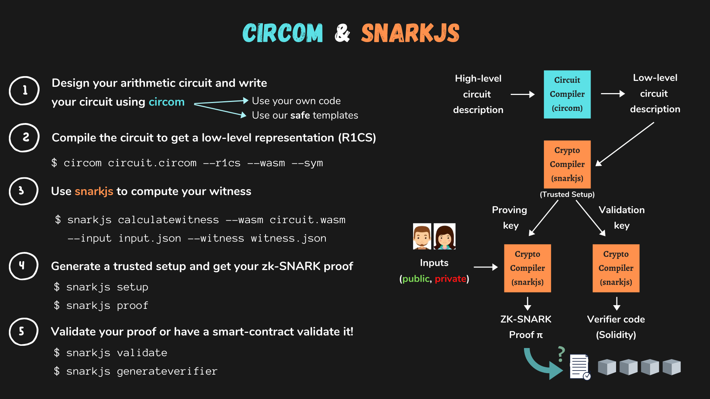

# zk-SNARK Snarkyjs versus "Circom, Snarkjs & Solidity"

In this tutorial I'm going to show you the implementation differences between zk-SNARK Snarkyjs versus Solidity zk-SNARK  using Circom, Snarkjs & Solidity.

## What is snarkyjs
SnarkyJS is a TypeScript library that makes it easy for developers to build powerful ZK applications without being cryptographers. Smart contracts written with SnarkyJS run in a user's web browser retaining privacy for the user's data inputs.

## What is Circom
Circom is a programming language to write programs (called circuits) that take a set of inputs, and describe constraints about them, as well as having one, many or no outputs.

## Tutorial Use Case
Let's say we have a key that shouldn't be revealed to anyone, but the possesion of the key is very important. It could be a privateKey that associated to a private key or a symetric key for encrypting a file.

We want to be able to show to everyone that we know this the key without revealing the actual key using zero knowledge proof zk-SNARKS. Proof x from H(x)

In this tutorial we are going to use Poseidon hash.

Poseidon is a hash function designed to minimize prover and verifier complexities when zero-knowledge proofs are generated and validated. Compared to competitor hash functions, such as Pedersen Hash, Poseidon uses up to 8x fewer constraints per message bit, which means that it is significantly faster.

## Installing the circom ecosystem
see also [Installing the circom ecosystem docs](https://docs.circom.io/getting-started/installation/)

### Install Rust
Download Rustup and install Rust
```bash
curl --proto '=https' --tlsv1.2 https://sh.rustup.rs -sSf | sh
```

Check version
```bash
rustup --version
```

### Install NPM & Nodejs
On mac:
```bash
brew install node
```
or Download Nodejs [here](https://nodejs.org/en/download)

On linux:
```bash
sudo apt install nodejs
sudo apt install npm
```

check version:
```bash
node -v
npm -v
```

### Installing circom
To install from circom sources, clone the circom repository:
```bash
git clone https://github.com/iden3/circom.git
```

Enter the circom directory and use the cargo build to compile:
```bash
cargo build --release
```

then
```bash
cargo install --path circom
```

Check version
```bash
circom --version
```

### Installing snarkjs
```bash
npm install -g snarkjs
```

## Steps Poseidon hash using Circom & Snarkjs & Solidity



### **Step 1. Writing our  Circuit**
Create a package.json:
```
npm init
```

Add circomlib:
```
npm install --save-dev circomlib
```
or
```
yarn add -D circomlib
```

Create a new directory:
```
mkdir circom-snarkjs-solidity
```

Create a new circom file poseidon.circom, see also [poseidon.circom]()

This file has 2 inputs and output the poseidon hash.
```
pragma circom 2.0.0;

include "../node_modules/circomlib/circuits/poseidon.circom";

template PoseidonHash() {
    var nInputs = 2;
    signal input inputs[nInputs];
    signal output out;

    component hasher = Poseidon(nInputs);
    for (var i = 0; i < nInputs; i ++) {
        hasher.inputs[i] <== inputs[i];
    }
    out <== hasher.out;
}

component main = PoseidonHash();

```

This is a code snippet written in the Circom programming language that defines a circuit that performs a hash function using the Poseidon algorithm. Let's break it down:

**What is circom?**
Circom is a domain-specific language (DSL) used for the specification and implementation of arithmetic circuits. It is designed specifically for use in zero-knowledge proof (ZKP) systems and is commonly used in conjunction with zk-SNARKs (Zero-Knowledge Succinct Non-Interactive Argument of Knowledge).

Circom allows developers to easily create and verify ZKP systems that are both efficient and secure. It is especially useful for creating circuits that involve complex mathematical computations, as it provides a convenient and intuitive way to express these computations in code. Overall, Circom simplifies the process of building ZKP systems and helps to ensure that they are correct and secure.

This line specifies the version of Circom being used.
```
pragma circom 2.0.0;
```

This line includes the Poseidon circuit implementation from the Circom library.
```
include "../node_modules/circomlib/circuits/poseidon.circom";
```

This defines a template for a circuit called "PoseidonHash" that takes two input signals and produces one output signal. The template defines a component called "hasher" that implements the Poseidon algorithm, and connects the inputs of the hasher component to the input signals of the template. The output signal of the hasher component is then connected to the output signal of the template.
```
template PoseidonHash() {
    ...
}
```

### **Step 2. Compiling our circuit**
```
mkdir ./circom-snarkjs-solidity/compiled
circom ./circom-snarkjs-solidity/PoseidonHash.circom --r1cs --wasm --sym --c -o ./circom-snarkjs-solidity/compiled
```

or run
```
npm run compile:circuit
yarn compile:circuit
```


### **Step 3. Computing our witness**
What is a witness?
Before creating the proof, we need to calculate all the signals of the circuit that match all the constraints of the circuit. For that, we will use the Snarkjs that helps to do this job.

**Computing the witness with Snarkjs**
Check the Snarkjs information:
```bash
snarkjs r1cs info ./circom-snarkjs-solidity/compiled/PoseidonHash.r1cs
```


As you can see above there are 2 private inputs on our circuit and 1 output with 240 contraints. The most of the constraints comes from poseidon.circom
```
include "../node_modules/circomlib/circuits/poseidon.circom";
```


Create your input file in json, this is your privatekey or your secret that you don't want to share

### **Step 4. Proving circuits with ZK**
After compiling the circuit and running the witness calculator with an appropriate input, we will have a file with extension .wtns that contains all the computed signals and, a file with extension .r1cs that contains the constraints describing the circuit. Both files will be used to create our proof.

Now, we will use the snarkjs tool to generate and validate a proof for our input. In particular, using the multiplier2, we will prove that we are able to provide the two factors of the number 33. That is, we will show that we know two integers a and b such that when we multiply them, it results in the number 33.

We are going to use the Groth16 zk-SNARK protocol. To use this protocol, you will need to generate a trusted setup. Groth16 requires a per circuit trusted setup. In more detail, the trusted setup consists of 2 parts:

The powers of tau, which is independent of the circuit.
The phase 2, which depends on the circuit.
Next, we provide a very basic ceremony for creating the trusted setup and we also provide the basic commands to create and verify Groth16 proofs. Review the related Background section and check the snarkjs tutorial for further information.

First, we start a new "Powers of Tau" ceremony:

**Powers of Tau**
// Explain power of Tau here

```
snarkjs powersoftau new bn128 10 ./circuits/powersOfTau28_hez_final_10.ptau
```

Then, we contribute to the ceremony:
```
cd circuits
snarkjs powersoftau contribute powersOfTau28_hez_final_10.ptau pot10_0001.ptau --name="First contribution" -v
```

Now, we have the contributions to the powers of tau in the file pot10_0001.ptau and we can proceed with the Phase 2.

**Phase 2**
The phase 2 is circuit-specific. Execute the following command to start the generation of this phase:
```
cd circuits
snarkjs powersoftau prepare phase2 pot10_0001.ptau pot10_final.ptau -v
```

Next, we generate a .zkey file that will contain the proving and verification keys together with all phase 2 contributions. Execute the following command to start a new zkey:
``` 
snarkjs groth16 setup ./circom-snarkjs-solidity/Poseidon/poseidonHashT3.r1cs pot10_final.ptau poseidonHashT3_0000.zkey
```

Contribute to the phase 2 of the ceremony:
```
snarkjs zkey contribute poseidonHashT3_0000.zkey poseidonHashT3_0001.zkey --name="1st Contributor Name" -v
```

Export the verification key:
```
snarkjs zkey export verificationkey poseidonHashT3_0001.zkey verification_key.json
```

### **Step 5. Generating a Proof**
Witness calculation:
Once the witness is computed and the trusted setup is already executed, we can generate a zk-proof associated to the circuit and the witness:
```
snarkjs groth16 prove poseidonHashT3_0001.zkey witness.wtns proof.json public.json
```
### **Step 6. Verifying a Proof**
To **verify the proof**, execute the following command:
```
snarkjs groth16 verify verification_key.json public.json proof.json
```

The command uses the files verification_key.json we exported earlier,proof.json and public.json to check if the proof is valid. If the proof is valid, the command outputs an OK.

A valid proof not only proves that we know a set of signals that satisfy the circuit, but also that the public inputs and outputs that we use match the ones described in the public.json file.

### **Step 7. Verifying from a Smart Contract**
​👉 It is also possible to generate a Solidity verifier that allows verifying proofs on Ethereum blockchain.

First, we need to generate the Solidity code using the command:
```
snarkjs zkey export solidityverifier poseidonHashT3_0001.zkey verifier.sol
```
This command takes validation key poseidonHashT3_0001.zkey and outputs Solidity code in a file named verifier.sol. You can take the code from this file and cut and paste it in Remix. You will see that the code contains two contracts: Pairing and Verifier. You only need to deploy the Verifier contract.

You may want to use first a testnet like Rinkeby, Kovan or Ropsten. You can also use the JavaScript VM, but in some browsers the verification takes long and the page may freeze.

The Verifier has a view function called verifyProof that returns TRUE if and only if the proof and the inputs are valid. To facilitate the call, you can use snarkJS to generate the parameters of the call by typing:
```
snarkjs generatecall
```
Cut and paste the output of the command to the parameters field of the verifyProof method in Remix. If everything works fine, this method should return TRUE. You can try to change just a single bit of the parameters, and you will see that the result is verifiable FALSE.


## **Circuit Script**
I have create scripts files to automate the above steps, just run the following command
```
chmod a+x ./scripts/compile-circuit.sh ./scripts/compile-poseidon-circuit.sh
./scripts/compile-poseidon-circuit.sh
```


## Testing circuit
Install dependencies:
```
yarn add -D ts-node typescript
yarn add -D chai @types/node @types/mocha @types/chai
yarn add -D circomlibjs circom_tester
```

Run circuit test
```
yarn test
```

## Steps Poseidon hash using Snarkyjs

### **Step 1. Install zkapp-cli**
```
 npm install -g zkapp-cli
 ```

 check version
 ```
 zkapp --version
 ```


### **Step 2. Create a new project**
```
zk project snarkyjs
```

Choose none with the question "Create an accompanying UI project too?"

```
cd snarkyjs
```
### **Step 3. Change Add.ts and Add.test.ts**
Secret.ts:
```
import { Field, Poseidon, Struct } from 'snarkyjs';

export { Secret };

class Secret extends Struct({
  secret: Field,
}) {
  static from(secret: Field): Secret {
    return new Secret({ secret });
  }

  static empty(): Secret {
    return new Secret({ secret: Field(0) });
  }

  hash(): Field {
    return Poseidon.hash(this.secret.toFields());
  }
}
```
Add.ts
```
import { Field, SmartContract, state, State, method } from 'snarkyjs';

import { Secret } from './Secret';

export class Add extends SmartContract {
  @state(Field) num = State<Field>();
  @state(Secret) secret = State<Secret>();

  init() {
    super.init();
    this.num.set(Field(1));
    this.secret.set(Secret.empty());
  }

  @method update() {
    const currentState = this.num.get();
    this.num.assertEquals(currentState); // precondition that links this.num.get() to the actual on-chain state
    const newState = currentState.add(2);
    this.num.set(newState);
  }

  @method setSecret(secret: Field) {
    this.secret.set(Secret.from(secret));
  }

  @method getSecret(): Field {
    return this.secret.get().hash();
  }
}

```

### **Step 4. Build and test**
```
npm run build
npm run test
```
